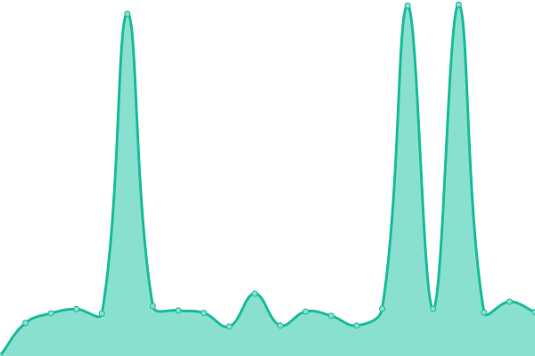
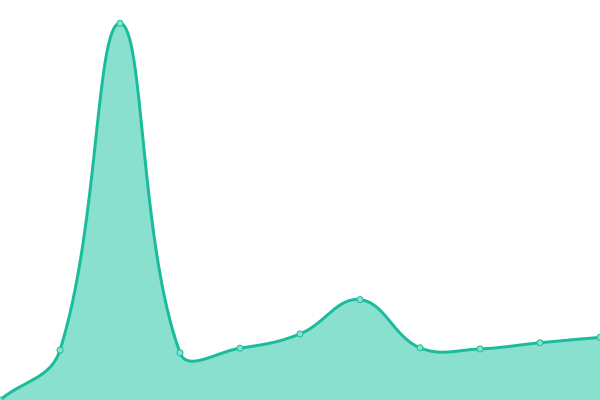

# [📈 Live Status](https://arillo.github.io/upptime): <!--live status--> **🟩 All systems operational**

This repository contains the open-source uptime monitor and status page for [Arillo](https://arillo.net), powered by [Upptime](https://github.com/upptime/upptime).

With [Upptime](https://upptime.js.org), you can get your own unlimited and free uptime monitor and status page, powered entirely by a GitHub repository. We use [Issues](https://github.com/arillo/upptime/issues) as incident reports, [Actions](https://github.com/arillo/upptime/actions) as uptime monitors, and [Pages](https://arillo.github.io/upptime) for the status page.

<!--start: status pages-->
<!-- This summary is generated by Upptime (https://github.com/upptime/upptime) -->
<!-- Do not edit this manually, your changes will be overwritten -->
<!-- prettier-ignore -->
| URL | Status | History | Response Time | Uptime |
| --- | ------ | ------- | ------------- | ------ |
|  [arillo.net](https://www.arillo.net) | 🟩 Up | [arillo-net.yml](https://github.com/arillo/upptime/commits/HEAD/history/arillo-net.yml) | 

 1869ms
     
 | 

<a href="https://uptime.arillo.de/history/arillo-net">100.00%</a>
    

|  Git | 🟩 Up | [git.yml](https://github.com/arillo/upptime/commits/HEAD/history/git.yml) | 

 1779ms
     
 | 

<a href="https://uptime.arillo.de/history/git">100.00%</a>
    

|  [unibz.it](https://www.unibz.it/health/check) | 🟩 Up | [unibz-it.yml](https://github.com/arillo/upptime/commits/HEAD/history/unibz-it.yml) | 

 2979ms
     
 | 

<a href="https://uptime.arillo.de/history/unibz-it">100.00%</a>
    

|  [guide.unibz.it](https://guide.unibz.it/health/check) | 🟩 Up | [guide-unibz-it.yml](https://github.com/arillo/upptime/commits/HEAD/history/guide-unibz-it.yml) | 

 2390ms
     
 | 

<a href="https://uptime.arillo.de/history/guide-unibz-it">100.00%</a>
    

|  [alpen-paesse.ch](https://alpen-paesse.ch/) | 🟩 Up | [alpen-paesse-ch.yml](https://github.com/arillo/upptime/commits/HEAD/history/alpen-paesse-ch.yml) | 

 2889ms
     
 | 

<a href="https://uptime.arillo.de/history/alpen-paesse-ch">100.00%</a>
    

|  Spacedeck wifo | 🟩 Up | [spacedeck-wifo.yml](https://github.com/arillo/upptime/commits/HEAD/history/spacedeck-wifo.yml) | 

 869ms
     
 | 

<a href="https://uptime.arillo.de/history/spacedeck-wifo">100.00%</a>
    

<!--end: status pages-->

[**Visit our status website →**](https://arillo.github.io/upptime)

## 📄 License

- Powered by: [Upptime](https://github.com/upptime/upptime)
- Code: [MIT](./LICENSE) © [Arillo](https://arillo.net)
- Data in the `./history` directory: [Open Database License](https://opendatacommons.org/licenses/odbl/1-0/)
